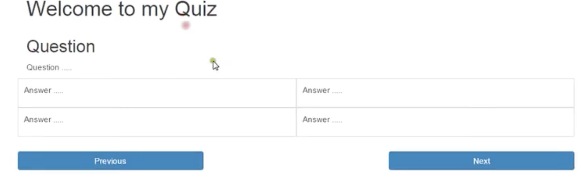

#### Quiz
===
Votre mission si vous l'acceptez est de créer un **quiz**, vous pouvez inventer l'interface ou vous inspirer du design suivant:

# Instructions:
+ Vous devrez faire le **HTML** & le **CSS** et le **Javascript** 
+ Vous devrez manipuler les éléments du **DOM** et créer les éléments **html** en javascript. 
+ Vous utiliserez un **framework**  __*bootstrap*__ ou __*autre*__

##  Règles:
+ Vous devez créer un fichier **JSON** valide qui contiendra les éléments du quiz sous forme de **"propriété"** : **valeur,** ([Créer son Json](https://jsonformatter.org/dc713e)) 
+ Celui-ci aura 10 questions
+ Avec **4 réponses** associées à chaque question
+ La bonne réponse pour chaque question
+ Vous pouvez le créer vous-même partir d'un thème de votre choix ou partir d'un quiz exixtant en vous inspirant de ceux-ci : [quiz](http://www.quiz-en-folie.com/)
+ Dans le cas d'une mauvaise réponse (alors la case de la réponse devient rouge)
+ Dans le cas d'une bonne réponse (la case devient verte).
+ Dans le cas ou nous revenons sur une question précedente et que nous avions validé une réponse alors celle-ci est toujours ( soit verte, soit rouge)
+ Vous pouvez allez plus loins si vous le souhaitez...
+ Vous pouvez collaborer également !

### Que la force de l'internet soit avec vous !

